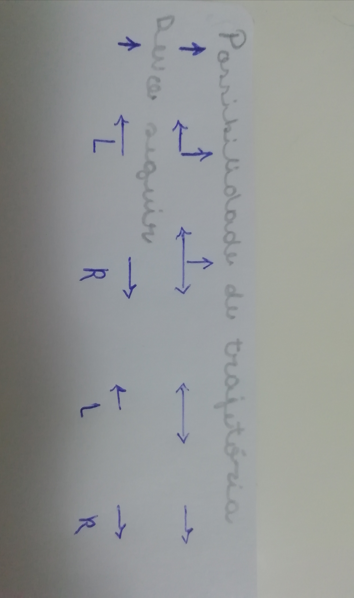

# Relatório do TP1
## Autor: Marta Capa
## Data: 2024-09-09

### Resumo 
O tp1 consistiu na realização de 2 exercicios 
*Resolver o exercico 10 do maze
*desenhar com o turtle um sol, uma casa  e uma árvore

#### Exercício 10 do maze
Para resolver o exercício 10 do maze baseei o meu raciocíonio no facto de que apenas vou seguir o caminho da direita se houver a possibilidade de seguir em frente, virar à direita e à esquerda ou se esse for o único possível. Só viro à esquerda se as opções de trajetória forem seguir em frente e virar à esquerda ou virar à esquerda e à direita. Apenas sigo em frente se esse for o único caminho disponível.

